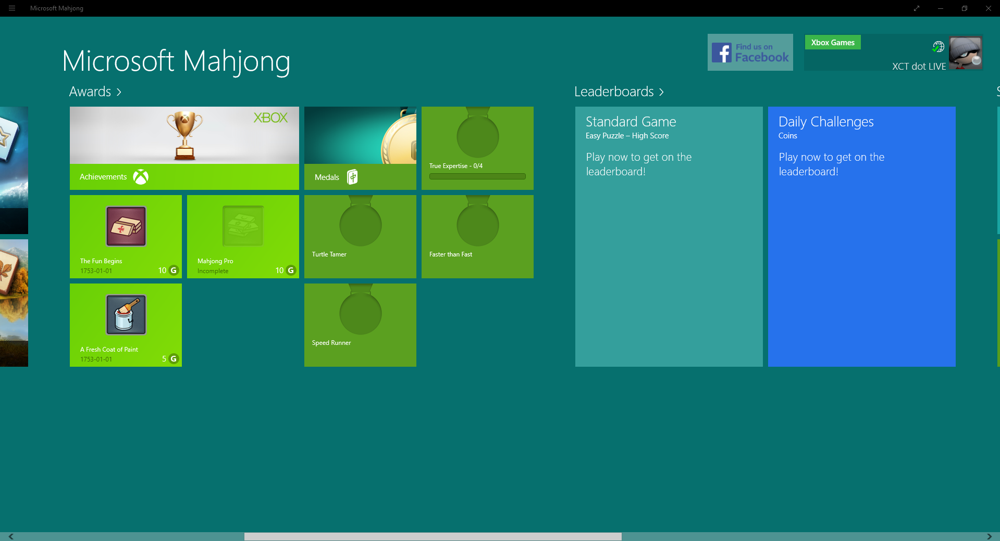
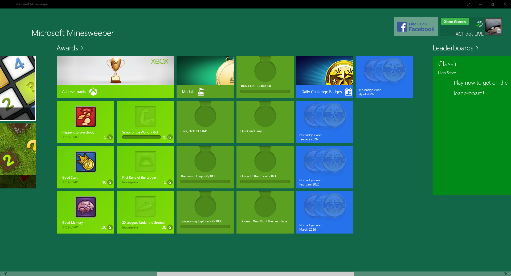
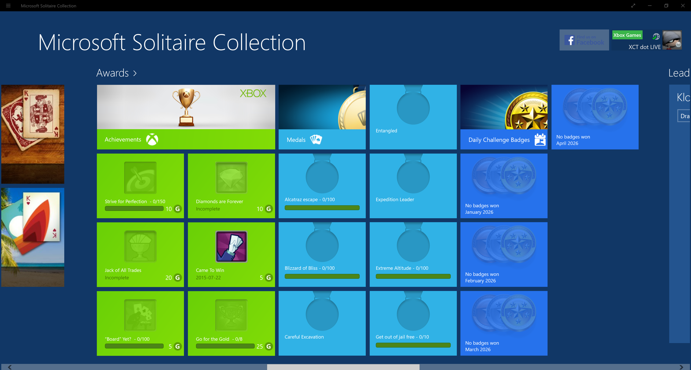
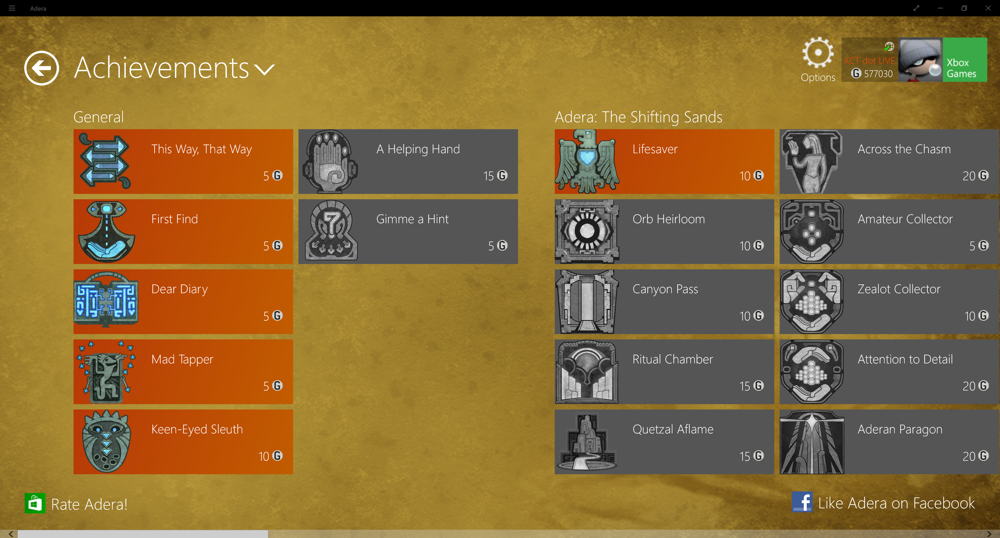
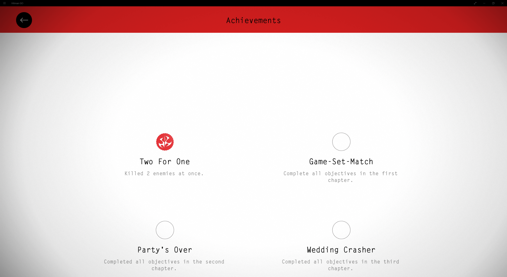
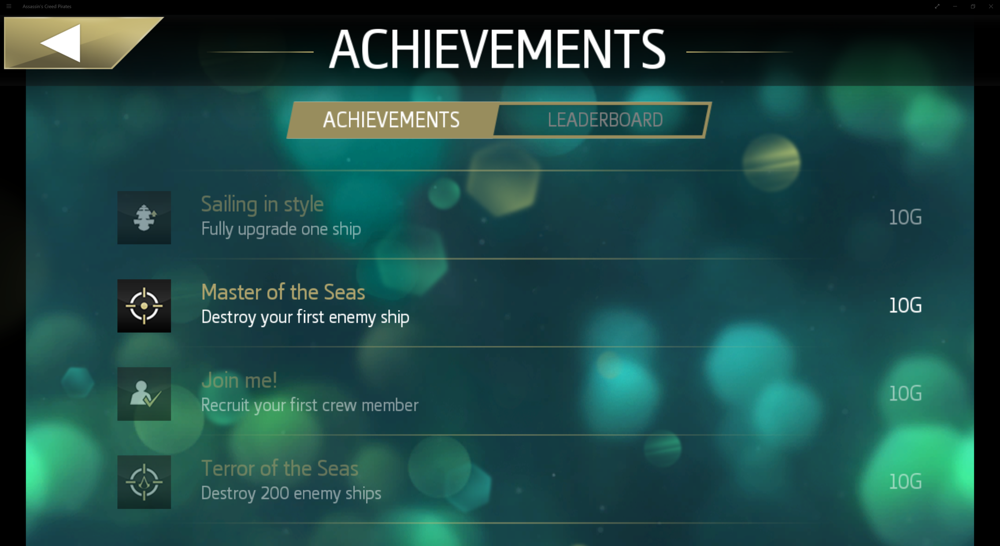

# xct-win8bridge

**Restoring Xbox Live sign-in for legacy Microsoft Store / Windows 8-era games on Windows 10 and 11 — using only public, documented Microsoft APIs.**

Microsoft quietly deprecated the old `XBL2.0`-formatted XSTS tokens used by the original Windows 8 Store generation of first-party titles. The games still install, still launch, still talk to `*.xboxlive.com` — but every request returns `HTTP 401 token_required` from the server, the in-game sign-in prompt never completes, and features that depend on the player's Xbox Live identity (gamerpic, friend list, **achievements**, leaderboards) go dark.

This project is a **working proof that those titles can be bridged to the modern `XBL3.0` token format entirely via public, documented APIs** — no reverse-engineered private endpoints, no spoofed client IDs, no process injection, no binary patching. The goal is to demonstrate to Microsoft that the legacy stack can be reactivated with a thin compatibility layer, so that the preservation of these titles — and the achievement records users earned on them — is technically achievable.

## Featured

The project has been covered in the press as a potential path to revive hundreds of broken Windows 8-era Xbox Live titles:

- **Pure Xbox** — [Xbox PC Project Might Have Solved How To Fix Hundreds Of Broken Windows Games](https://www.purexbox.com/news/2026/04/xbox-pc-project-might-have-solved-how-to-fix-hundreds-of-broken-windows-games)
- **r/xbox** — [Microsoft Could Fix Hundreds Of Broken Xbox Games](https://www.reddit.com/r/xbox/comments/1srhvdy/microsoft_could_fix_hundreds_of_broken_xbox/)

Follow progress on X: [**@XCTdotLIVE**](https://x.com/XCTdotLIVE). We're continuing to add more games — watch the [Status](#status) table and the [changelog](CHANGELOG.md).

## Status

> **Aim: every legacy Windows 8-era first-party Xbox Live title.**
> **Currently: 7 of 7 tried, working.**

| Title | TitleId | Sign-in | Gamerpic | Achievements |
|---|---|:---:|:---:|:---:|
| Microsoft Mahjong (1.9.0.40714) | 1297290225 | ✓ | ✓ | ✓ |
| Microsoft Minesweeper (2.9.1913.0) | 1297290226 | ✓ | ✓ | ✓ |
| Microsoft Solitaire Collection (2.11.1807.1002) | 1297287741 | ✓ | ✓ | ✓ |
| Microsoft Adera (2.5.2.34894) | 1297290206 | ✓ | ✓ | ✓ |
| Hitman GO (1.0.52.0, Square Enix) | 1397824345 | ✓ | n/a | ✓ |
| Hydro Thunder Hurricane (1.2.5.0, Microsoft Studios / Vector Unit) | 1297290211 | ✓ | n/a | ✓ |
| Assassin's Creed Pirates (Ubisoft) | (see bridge log `[xbl_bridge] titleachievements merge: tid …`) | ✓ | n/a | ✓ |

Microsoft Mahjong with gamertag, gamerpic and its legacy XBL2-era achievement set all populating through the bridge:



Microsoft Minesweeper likewise — same bridge, no title-specific code:



Microsoft Solitaire Collection — gamertag, gamerscore, full Awards grid and Daily Challenge badges all populated:



Microsoft Adera — unlocked by v1.1's XSts response forgery. Gamerscore 577030 + the General and Adera: The Shifting Sands achievement sets rendering:



Hitman GO — first non-Microsoft-published Win8.1 title to come up on the bridge. v1.3's "always rewrite `XBL2.0` → `XBL3.0`" change unblocked the `profile.xboxlive.com` 401 that the prior reactive-forgery logic missed for this MSA cohort, and the new `packagespc.xboxlive.com/GetBasePackage` 403→200 shim got the game past its pre-achievements package-validation gate. Achievement set rendering with the Two For One unlock visible:



Hydro Thunder Hurricane — Microsoft Studios / Vector Unit Win8 port. Unusually for the portfolio, this title doesn't query an achievements service at all: unlock state is encoded in the user's `titlestorage` cloud save (a `SCUV`-magic binary in the title's titlegroup). The bridge gets the legacy `auth.xboxlive.com/XSts` SOAP → `profile.xboxlive.com` → cloud-save load chain through cleanly, and unlocks register as the player earns them. Splish Splash + Spare Change shown unlocked after a single race:


Assassin's Creed Pirates — first Ubisoft title on the bridge. The legacy `progress.xboxlive.com/.../progress/titleachievements` catalog is fetched as normal, then v1.5's v1-unlock merge stamps the player's actual unlock state from `achievements.xboxlive.com` onto matching catalog rows by `id`, so the in-game Achievements panel renders the user's real progress instead of an all-locked list:



Daily Challenge loaders in Mahjong are blocked by a separate, unrelated problem — the Arkadium backend that hosts the challenge content is itself decommissioned. That's out of scope here and lives under a different umbrella.

## Why this is Microsoft-friendly

Design constraints we hold ourselves to:

- **Only public, documented APIs.** `WebAuthenticationCoreManager` (WinRT broker), `user.auth.xboxlive.com` + `device.auth.xboxlive.com` + `xsts.auth.xboxlive.com` (public XBL mint chain). Nothing private, nothing reversed.
- **The calling identity is our own.** A user-registered Azure AD / Entra app (personal Microsoft accounts). Not Microsoft's Android Xbox client ID, not the Store's, not someone else's. Anyone forking this project registers their own.
- **No process injection, no binary modification of game executables.** The bridge is strictly a network interceptor.
- **No private IPC into Gaming Services / Xbox components.** We don't poke at the `xgameruntime.dll` broker or shim any system DLLs. Everything the bridge does could be done by a first-class Microsoft-provided compatibility service.

If Microsoft implemented the same transformation server-side, this project would become obsolete — and that's the intended outcome.

## How it works

Two components:

### 1. `ticket_server` — a tiny Rust HTTP service

Exposes `GET http://127.0.0.1:8099/ticket` and returns an **MBI_SSL compact ticket** for `user.auth.xboxlive.com`, minted via the Windows [`WebAuthenticationCoreManager`][wam] broker against the MSA already signed into the operating system. No popup, no secondary login.

Under the hood this is `FindAccountProviderWithAuthorityAsync("https://login.microsoft.com", "consumers")` → `WebTokenRequest(provider, "service::user.auth.xboxlive.com::MBI_SSL", <your_client_id>)` → `GetTokenSilentlyAsync`. First run may prompt once for consent; subsequent runs are silent.

[wam]: https://learn.microsoft.com/en-us/windows/uwp/security/web-account-manager

### 2. `xbl_bridge.py` — a [mitmproxy][mitmproxy] addon

On startup:

1. Fetches the MBI_SSL ticket from `ticket_server`.
2. Exchanges it at `https://user.auth.xboxlive.com/user/authenticate` → XBL `UserToken`.
3. Exchanges `UserToken` at `https://xsts.auth.xboxlive.com/xsts/authorize` (RelyingParty `http://xboxlive.com`, UserTokens only) → XSTS token + UserHash.
4. Assembles an `Authorization: XBL3.0 x=<UserHash>;<XSTS>` header.

On each game request to `*.xboxlive.com`:

- Legacy mint calls to `auth.xboxlive.com/XSts/xsts.svc/IWSTrust13` pass through untouched (the game needs its 200 OK to keep its sign-in state machine moving).
- Endpoints that only speak XBL2.0 server-side (`stats.xboxlive.com`, `communications.xboxlive.com`) pass through untouched — our rewrite would actively break them.
- Everything else with `Authorization: XBL2.0 ...` gets the Authorization header swapped for our XBL3.0 one. **Nothing else is touched.** Not the body, not `x-xbl-contract-version`, not anything. (We tried bumping + translating — legacy games' response parsers quietly reject the modern shape.)
- Per-user title-group storage (`titlestorage.xboxlive.com/users/xuid(...)/storage/titlestorage/titlegroups/<guid>/...`) returns `403` because our XSTS is not title-scoped — Title-bound tokens require a title's private signing key which only Microsoft has. We shim these with empty-body `200` (GET) / `200` acknowledgements (PUT) so legacy "no saved state yet" behavior kicks in cleanly, rather than the game interpreting 403 as a download failure.

[mitmproxy]: https://mitmproxy.org

```
      ┌─── Windows MSA (already signed into OS) ────┐
      │                                             │
      ▼                                             │
 WebAuthenticationCoreManager ──── MBI_SSL ticket ──┘
                │
                ▼
       ticket_server (Rust)
                │  GET /ticket
                ▼
       xbl_bridge.py (mitmproxy addon)
                │
   user.auth.xboxlive.com   ← MBI
   device.auth.xboxlive.com ← (not needed; simple flow)
   xsts.auth.xboxlive.com   ← UserToken
                │
       XBL3.0 x=<uhs>;<xsts>
                │
                ▼
      legacy game's outgoing *.xboxlive.com traffic
        (Authorization header swapped; everything
         else passes through unchanged)
```

## Requirements

- Windows 10 or 11
- Python 3 with `mitmproxy` and `ecdsa`:

  ```
  pip install mitmproxy ecdsa
  ```

- Rust (stable) — **only if building `ticket_server` from source.** The repo ships a prebuilt `bin\ticket_server.exe` so end-users do not need Rust and `launch.bat` works offline out of the box. Install Rust only if you're working on the helper itself:

  ```
  cargo build --release --bin ticket_server
  ```

- An Azure AD / Entra app registration to identify the caller of `WebAuthenticationCoreManager`.  **You don't have to register your own** — this repo ships with a working client ID in `src/bin/ticket_server.rs` that you're welcome to reuse. It's a public client ID (no secret), scoped to "Personal Microsoft accounts only", and does nothing beyond requesting Xbox Live user tickets for whoever consents to it. If you'd rather own the identity, see [Registering your own app](#registering-your-own-app-optional) below.

- The mitmproxy CA certificate trusted in the Windows Local Machine certificate store so `*.xboxlive.com` TLS can be intercepted. mitmproxy prints the command once when you first run it.

- The UWP game's `AppContainer` must be loopback-exempted so it can reach `127.0.0.1:8080`:

  ```
  CheckNetIsolation LoopbackExempt -a -n="Microsoft.MicrosoftMahjong_8wekyb3d8bbwe"
  CheckNetIsolation LoopbackExempt -a -n="Microsoft.MicrosoftMinesweeper_8wekyb3d8bbwe"
  ```

## Setup

### Quick start (one click)

Double-click **`launch.bat`** at the repo root. Everything runs in a single console window — setup output scrolls past, then `mitmdump`'s live intercept log takes over. The launcher will:

1. Self-elevate (UAC prompt — needed for cert install, WinHTTP proxy, and loopback exemptions),
2. Check GitHub for a newer tagged release and auto-update itself in place if one exists (skipped offline or if you have a `.git` checkout),
3. Install the Python dependencies (`mitmproxy`, `ecdsa`),
4. Use the bundled `bin\ticket_server.exe` (or a locally-built one if you have Rust),
5. Generate + trust the mitmproxy CA in the Windows Local Machine root store,
6. Grant loopback exemptions to the supported games,
7. Start `ticket_server` hidden in the background (log: `%TEMP%\xct_ticket_server.log`),
8. Enable the WinINET + WinHTTP system proxies,
9. Run `mitmdump` in the foreground of the launcher window.

**To stop**: press `Ctrl+C`, then type `N` at the "Terminate batch job (Y/N)?" prompt. `N` lets `stop.bat` run and reverses the proxy changes. `Y` aborts immediately and leaves the proxies pointed at `127.0.0.1:8080` — if that happens, double-click `stop.bat` to recover.

Once it prints `READY`, launch Microsoft Mahjong or Microsoft Minesweeper from Start. The `mitmdump` window scrolls every request the bridge rewrites:

```
[xbl_bridge] bridged GET profile.xboxlive.com/users/me/id
[xbl_bridge] bridged GET titlestorage.xboxlive.com/users/xuid(...)/storage/titlestorage/titlegroups/.../data/unverified/DailyChallengeSettings,json
[xbl_bridge] titlestorage shim: GET 403->200(empty) /users/xuid(...)/.../DailyChallengeSettings,json
```

When you're done, press any key in the launcher window (or double-click **`stop.bat`**) to disable the proxies and stop the helpers. The CA and loopback exemptions stay installed so subsequent launches are near-instant.

### Manual run

If you prefer running the pieces by hand, in three separate terminals:

```
cargo build --release
target\release\ticket_server.exe
mitmdump -s addon\xbl_bridge.py --flow-detail 1
```

And enable the proxies:

```
reg add "HKCU\Software\Microsoft\Windows\CurrentVersion\Internet Settings" /v ProxyServer /t REG_SZ /d 127.0.0.1:8080 /f
reg add "HKCU\Software\Microsoft\Windows\CurrentVersion\Internet Settings" /v ProxyEnable /t REG_DWORD /d 1 /f
netsh winhttp set proxy proxy-server="127.0.0.1:8080" bypass-list="<-loopback>"
```

Teardown:

```
reg add "HKCU\Software\Microsoft\Windows\CurrentVersion\Internet Settings" /v ProxyEnable /t REG_DWORD /d 0 /f
netsh winhttp reset proxy
```

### Registering your own app (optional)

The bundled client ID is good enough to run this project; Microsoft issues you a personal MSA-scoped ticket when *your* account consents to *any* app requesting that scope. But if you'd rather own the identity yourself:

1. Open [portal.azure.com](https://portal.azure.com) → **App registrations** → **New registration**.
2. Name: whatever (e.g. `xct-win8bridge-<yourname>`).
3. **Supported account types: "Personal Microsoft accounts only"** — Xbox Live runs on consumer MSAs.
4. No redirect URI needed (the WAM broker path doesn't use OAuth web redirects).
5. Register, then copy the **Application (client) ID** GUID.
6. Under **Authentication → Advanced settings**, set **Allow public client flows** to Yes.
7. Replace `CLIENT_ID` in `src/bin/ticket_server.rs` and `src/bin/xal_probe.rs` with your GUID.

## Scope

UWP titles shipped with the legacy `Microsoft.Xbox.dll` + `xbl.spa` XBL2.0 SDK that authenticate via `auth.xboxlive.com/XSts/xsts.svc/IWSTrust13`. Detect these by checking the package install dir — if both files are present, this bridge should cover it.

## Forking notes

- **Reuse the bundled client ID freely**, or register your own — either works. The bundled one is a public client ID with no secret and no special privileges; each user's own Microsoft account is always what actually authenticates.
- **The MSA ticket never leaves the local machine.** `ticket_server` binds to `127.0.0.1` only. The XBL3.0 mint chain after that goes direct to `*.xboxlive.com`.
- **No retention.** This is not a token-caching layer. Every session re-mints.
- **Be a good neighbour.** The bridge exists to demonstrate the transformation, not to hammer XBL. Don't script it to mass-request.

## Acknowledgements

Built on the work and patience of the Xbox preservation community, particularly the xbox-collection-tracker project whose proven XBL auth primitives informed the initial exploration here.

---

> If you work at Microsoft on the Xbox Live platform and are reading this: **please**, the only thing separating these titles from still-working is a thin XBL2→XBL3 translation layer the server no longer performs. Every transformation this project does is mechanical and could be done server-side.
